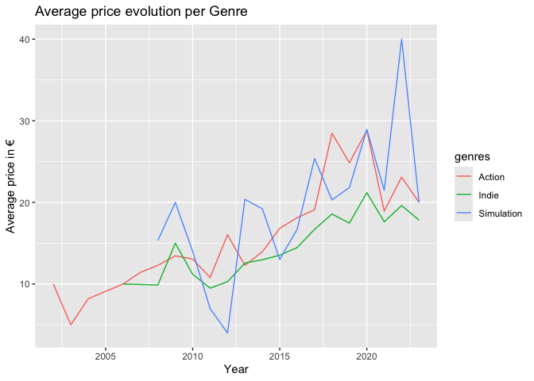

<!-- README.md is generated from README.Rmd. Please edit that file -->

# steamr

<!-- badges: start -->

[](https://github.com/maxikuehn/steamr/actions/workflows/R-CMD-check.yaml)

<!-- badges: end -->

The goal of *steamr* is to visualize and process video game data from
steam.

## Installation

You can install the development version of steamr from
[GitHub](https://github.com/maxikuehn/steamr) with:

``` r
# install.packages("pak")
pak::pak("maxikuehn/steamr")
```

## Example

This is a basic example which shows you how you can access the games
dataset:

``` r
library(steamr)
head(games[, c("app_id", "name", "price", "metacritic")])
#>    app_id                                    name price metacritic
#> 1   22670                  Alien Breed 3: Descent  9.99         64
#> 2  231330                     Deadfall Adventures 19.99         53
#> 3  897820                 Reigns: Game of Thrones  3.99         84
#> 4  457140                     Oxygen Not Included 22.99         85
#> 5 1345820                               Ragnarock 21.99         87
#> 6    7940 Call of Duty® 4: Modern Warfare® (2007) 19.99         92
```

The exported function `avgpriceperyear` makes it easy to visualize the
average price of game genres each year.

``` r
avgpriceperyear(games, selectedgenres = c("Action", "Indie", "Simulation"))
```



You can also create a S3 Object of a specific game:

``` r
g <- get_game_details(72850)
print(g)
#> Game Details:
#> app_id: 72850
#> name: The Elder Scrolls V: Skyrim
#> description: EPIC FANTASY REBORN The next chapter in the highly anticipated Elder Scrolls saga arrives from the makers of the 2006 and 2008 Games of the Year, Bethesda Game Studios. Skyrim reimagines and revolutionizes the open-world fantasy epic, bringing to life a complete virtual world open for you to explore any way you choose.
#> image: https://shared.akamai.steamstatic.com/store_item_assets/steam/apps/72850/header.jpg?t=1721923139
#> developers: ['Bethesda Game Studios']
#> publishers: ['Bethesda Softworks']
#> price: 14.99
#> metacritic: 94
#> genres: ['RPG']
#> recommendations: 181044
#> release_date: 2011-11-10
```
